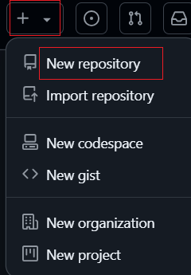

## Tạo Repo mới cách 1

- Tại trang github.com 
Nhấn tạo repository mới

- Tại Repository name
Nhập tên dự án

- Tại Description (optional) (Không bắt buộc)
Nhập mô tả về dự án
Bên dưới thiết lập độ công khai dự án là public hay private. Thường sẽ để private

- Tại Initialize this repository with:
Nên đánh dấu vào Add a README file, đây là file mô tả chung về toàn bộ dự án. Khi mở repo sẽ đọc thấy nó ngay bên dưới

- Tại Add .gitignore
Chọn Unity để bỏ qua các file thư viện unity khi đồng bộ